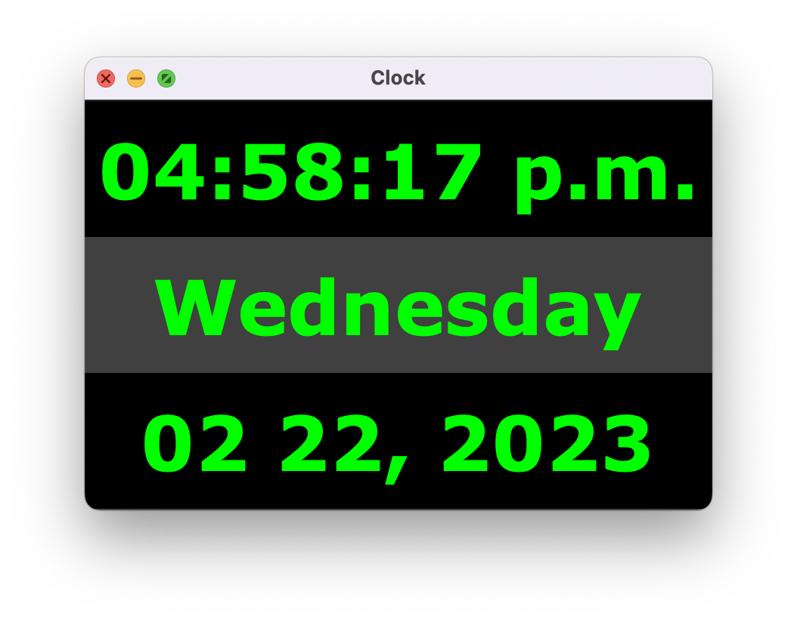

# Clock with Java's GUI

The following is the code for a simple clock done in Winter 2021. This is a simple version of a clock and was made to build more familiarity with java's GUI and built-in functions to retrieve and manipulate date and time.

## How the clock looks like:

